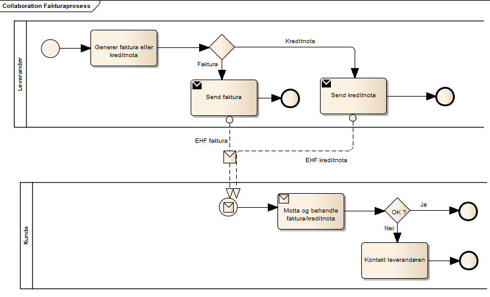

# Fakturaprosessen
Fakturaprosessen omfatter opprettelse og oversendelse av faktura og kreditnota fra leverandør til kunde, samt mottak og behandling hos kunde.

Fakturaprosessen kan beskrives ved følgende arbeidsflyt:
1.	En leverandør utsteder og sender en EHF Faktura til en kunde.  Fakturaen refererer til en eller flere ordre samt en spesifikasjon av leverte varer og tjenester. En faktura kan også referere til en kontrakt eller rammeavtale. Fakturaen kan inneholde artikler (varer eller tjenester) med artikkelnummer eller artikler med fritekstbeskrivelse.  
1.	Kunden mottar fakturaen og behandler denne i sitt fakturakontrollsystem.  Resultatet av fakturakontrollen vil være en av følgende:
  1.	Kunden aksepterer fakturaen i sin helhet, bokfører den i regnskapet og sender den videre til betaling.
  1.	Kunden avviser fakturaen i sin helhet, tar kontakt med leverandøren og anmoder om at kreditnota utstedes.
  1.	Kunden bestrider deler av fakturaen, tar kontakt med leverandøren og anmoder om at kreditnota samt ny faktura ustedes.

Figuren under viser fakturaprosessen ved bruk av EHF Fakturameldingene. Denne prosessen er basert på profil 5 i CENBII (BII05 – Billing) som forutsetter at både faktura og kreditnota blir sendt elektronisk.  Profilen inneholder også meldingstypen «Corrective invoice».  Denne benyttes ikke i Norge.  Dersom kunden ikke aksepterer fakturaen, må leverandøren utstede kreditnota og eventuelt ny faktura.

## Avvikshåndtering, validering hos avsender

En EHF Faktura eller EHF Kreditnota skal valideres hos avsender før den blir sendt videre i transportinfrastrukturen.  For beskrivelse av valideringsprosessen, ref. kapittel 8.  Validering kan utføres på ulike tidspunkt og av ulike tjenester:  

1.	I ERP-systemet.  Validering er inkludert i prosessen som oppretter faktura/kreditnota dokumentet.  Hvis valideringen feiler, vil det ikke bli opprettet noe dokument.  Grunnlagsdata for oppretting av faktura/kreditnota dokument må justeres og generering av faktura/kreditnota dokumentet kjøres på nytt.  
1.	Tjenestetilbyder av aksesspunkttjenesten utfører validering ved mottak av dokument fra sine kunder.  Hvis valideringen feiler, sendes melding tilbake til kunden og dokumentet sendes ikke videre i transportinfrastrukturen.  Utsteder av dokumentet har i dette tilfellet 2 alternativer:
  1.	Dersom dokumentet ikke er utstedt i regnskapsteknisk betydning, dvs. Ikke bokført i eget regnskap, kan det endres og sendes på nytt.
  1.	Dersom dokumentet er utstedt, kan ikke dokumentet endres.  Istedet må det opprettes kreditnota for fakturaen (intern kreditering).  Merk at denne kreditnotaen IKKE må sendes til aksesspunktet siden original-fakturaen feilet ved validering og dermed ikke ble videresendt til fakturamottaker.

## Avvikshåndtering, validering hos mottaker

Noen mottakere vil validere innkommende dokument selv om de skal være validert før utsendelse i transportinfrastrukturen.  En får da følgende scenarier:

1.	Dokumentet feiler i valideringen:
  1.	Grunnet  bruk av ulike versjoner av EHF formatene (Ref. kap. 2.1.2). Mottaker må behandle EHF dokumentet manuelt.
  1.	Andre årsaker.  Mottaker sender Message Level Respons til leverandør for å få nytt korrekt EHF dokument. Dokumentet blir ikke behandlet hos mottaker.
1.	Validering OK, men mottaker bestrider hele eller deler av innholdet i dokumentet.   Mottaker kontakter avsender manuelt og gir beskjed om dette.  Avsender oppretter og sender kreditnota, og eventuelt en ny faktura.     
